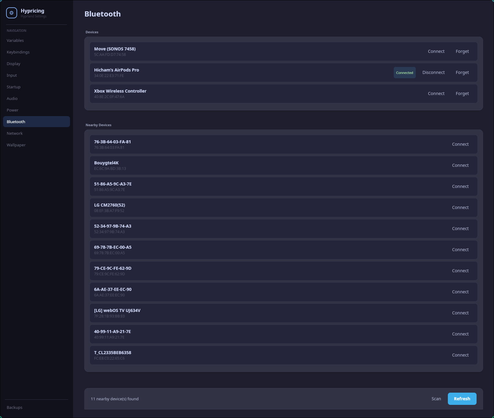

# Hypricing

A GUI settings manager for [Hyprland](https://hyprland.org). Provides a graphical interface over existing Linux tools and manages Hyprland configuration files directly.

## Features

- **Variables** — add, edit, and remove `$var` declarations and `env` environment variables
- **Keybindings** — manage `bind`, `binde`, `bindm` and other bind variants
- **Display** — drag-and-drop monitor layout with edge snapping
- **Input** — keyboard layout, mouse sensitivity, cursor behavior, touchpad settings
- **Startup** — manage `exec`, `exec-once`, and `exec-shutdown` entries
- **Audio** — volume, mute, default device, stream routing (PipeWire + PulseAudio, extensible via JSON presets)
- **Power** — switch power profiles (performance / balanced / power-saver) via `powerprofilesctl`; battery status on laptops
- **Bluetooth** — scan, pair, connect, and disconnect devices
- **Network** — view nearby Wi-Fi networks and connection status
- **Wallpaper** _(in progress)_ — set wallpaper per monitor; auto-detects `awww`, `swww`, or `hyprpaper`
- **Backups** — create, restore, and delete zip backups of all config files
- **Multi-file support** — follows `source =` includes across config files
- **Native AOT** — 18MB self-contained binary, no runtime needed

## Screenshots



## Install

### AUR (Arch Linux)

```bash
yay -S hypricing-git
```

### From source

```bash
dotnet publish src/Hypricing.Desktop/Hypricing.Desktop.csproj -c Release -r linux-x64 --self-contained true -o publish
sudo cp publish/Hypricing.Desktop /usr/bin/hypricing
```

## Stack

- .NET 10
- Avalonia UI 11
- Native AOT
- Linux x64

## Roadmap

| Version | Scope |
|---|---|
| v0.1 | Parser, variables, keybindings, display, startup, backups, Native AOT |
| v0.2 | Audio (PipeWire + PulseAudio, JSON presets) |
| v0.3 | Input page (keyboard, mouse, cursor, touchpad) |
| v0.4 | Power page (profiles via `powerprofilesctl`, battery status) |
| v0.5 | Bluetooth page |
| v0.6 | Network page |
| v0.7 | Bluetooth scan UI |
| **v0.8** | **Monitor page overhaul** — HDR, refresh rate, scale, transform, VRR, and all `monitor =` options; redesigned drag-and-drop layout |
| | **Hyprland v0.55 warning** — in-app notice about the upcoming config format change |
| | **Wallpaper page** — set wallpaper per monitor; auto-detects `awww`, `swww`, or `hyprpaper` |
| | **Keybinding fixes** — argument field on existing bindings; new bindings written to the correct source file instead of always `hyprland.conf` |
| | **File segregation on save** — Save button routes each option to the file it belongs to |
| | **Hyprland v0.55+ detection** — detect config format on load; if ≥ v0.55 and not Lua, use the new parser path on next save |
| | **uwsm detection** — if `uwsm` is present, expose its session variables for viewing and editing |
| | **UI / button rework** — consistent button styles, spacing, and interaction states across all pages |
| | **Blueman detection** — if `blueman` is installed, show a launch shortcut in the Bluetooth page |
| | **HyprSunset** — detect and manage HyprSunset if installed via `hyprpm` |
| | **Plugin management** — manage daily-use Hyprland plugins via `hyprpm` |
| v0.9 | Polish, keyboard navigation, themes, structured option inputs |

## Project Structure

```
Hypricing/
├── src/
│   ├── Hypricing.HyprlangParser/   # Pure parser — text → AST → text
│   ├── Hypricing.Core/             # Business logic — services + models
│   └── Hypricing.Desktop/          # Avalonia UI — views + viewmodels
└── tests/
    ├── Hypricing.HyprlangParser.Tests/
    └── Hypricing.Core.Tests/
```

## License

See [LICENSE](LICENSE).
